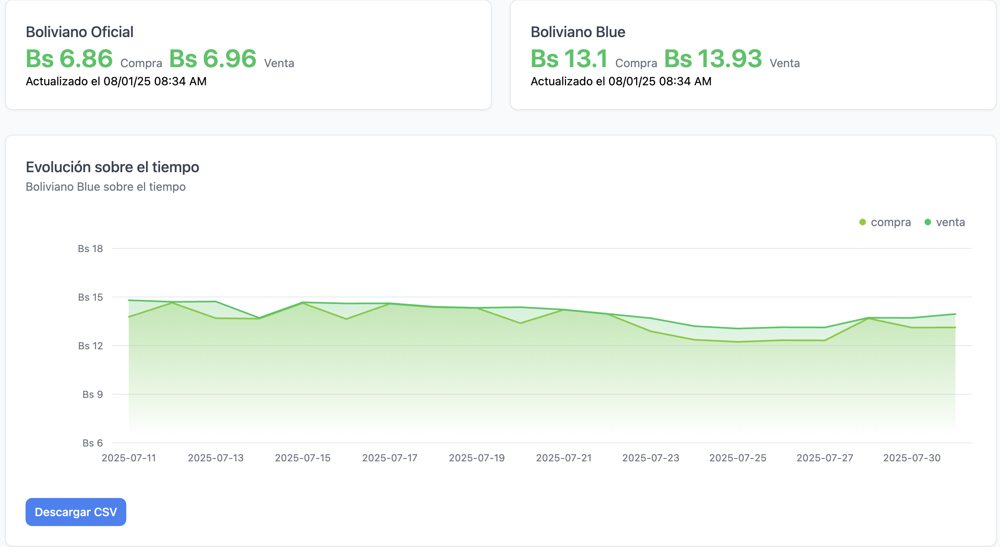

# 🇧🇴 Bolivian Blue

Una plataforma de transparencia para el valor del dólar en Bolivia.



*Vista previa de la aplicación mostrando las tasas de cambio oficiales y del mercado azul, junto con la evolución histórica de precios.*

## 📖 Acerca del Proyecto

**Bolivian Blue** es una página web que proporciona transparencia en relación al valor del dólar en Bolivia. Nació como un MVP (Producto Mínimo Viable) con el objetivo de ofrecer información clara y accesible sobre el tipo de cambio.

## 🚀 Estado del Proyecto

Este proyecto se encuentra en desarrollo activo. Se estará trabajando en mejoras eventuales para proporcionar una mejor experiencia de usuario y más funcionalidades.

### Próximas Mejoras

- Liberación del backend
- Nuevas funcionalidades
- Mejoras en la interfaz de usuario
- Optimizaciones de rendimiento
- **Información en tiempo real**: Estamos trabajando para obtener información actualizada en tiempo real sobre tipos de cambio y comisiones bancarias

## 🤝 Contribuciones

¡Todos pueden contribuir al proyecto! Las contribuciones son bienvenidas y apreciadas.

Si quieres contribuir, puedes hacerlo en: **https://github.com/therealcrucenho/bolivianblue**

### Cómo Contribuir

1. **Pull Requests**: Crea un PR con tus mejoras, correcciones o nuevas funcionalidades
2. **Issues**: Reporta bugs, sugiere nuevas características o discute mejoras
3. **Documentación**: Ayuda a mejorar la documentación del proyecto

### Proceso de Contribución

1. Haz un fork del repositorio
2. Crea una rama para tu feature (`git checkout -b feature/nueva-funcionalidad`)
3. Realiza tus cambios y haz commit (`git commit -m 'Agrega nueva funcionalidad'`)
4. Sube tu rama (`git push origin feature/nueva-funcionalidad`)
5. Abre un Pull Request

## 🛠️ Tecnologías

- Next.js
- React
- TypeScript
- Tailwind CSS

## 📦 Instalación

```bash
# Clona el repositorio
git clone https://github.com/[tu-usuario]/bolivian-blue.git

# Navega al directorio del proyecto
cd bolivian-blue

# Instala las dependencias
npm install
# o
pnpm install

# Ejecuta el servidor de desarrollo
npm run dev
# o
pnpm dev
```

Abre [http://localhost:3000](http://localhost:3000) en tu navegador para ver el resultado.

## 📄 Licencia

Este proyecto está abierto para contribuciones de la comunidad.

## 👥 Equipo y Comunidad

**CEO:** @therealcrucenho en Twitter

Ethical Hacker, Dev, Fiel seguidor del descentralismo

Este proyecto es impulsado por una comunidad comprometida con la transparencia y el acceso libre a la información financiera en Bolivia.

## 🌟 Agradecimientos

Gracias a todos los contribuidores que hacen posible este proyecto y a la comunidad boliviana por su apoyo.

## 🎉 Celebrando los 200 Años de Bolivia

¡Felicitaciones a Bolivia por sus 200 años de independencia! Este proyecto es un pequeño homenaje a la transparencia y el acceso a la información que merecemos todos los bolivianos. 🇧🇴✨

---